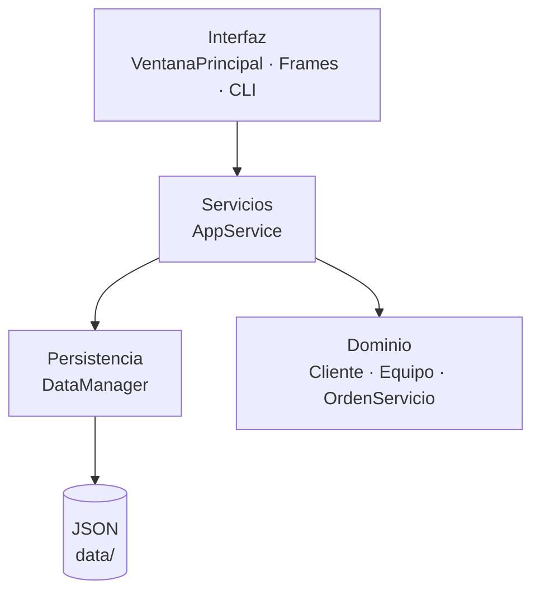
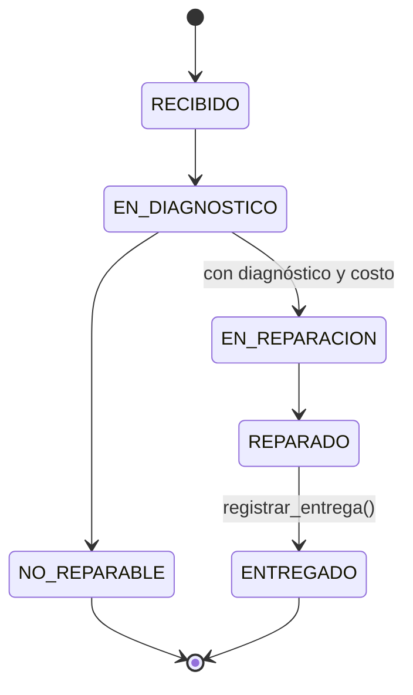
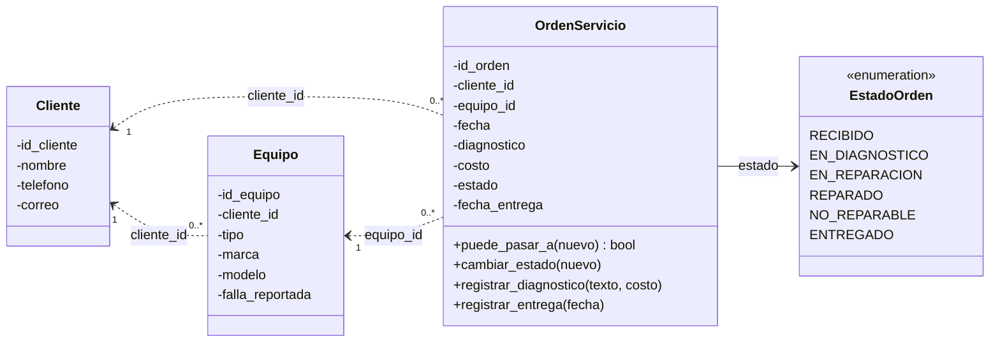
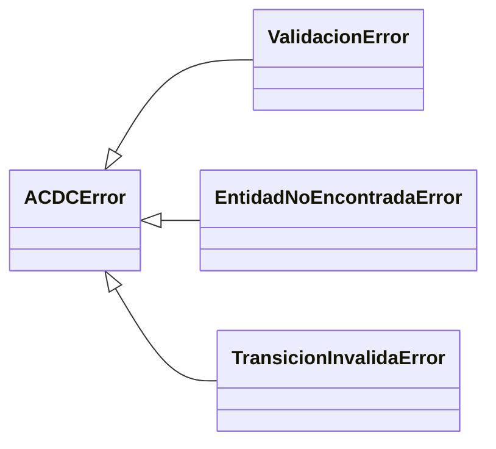
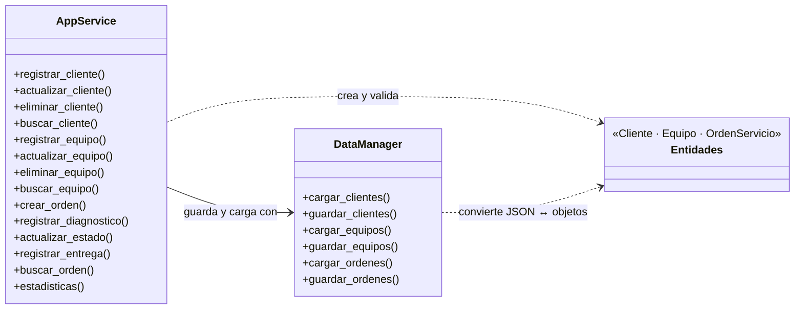
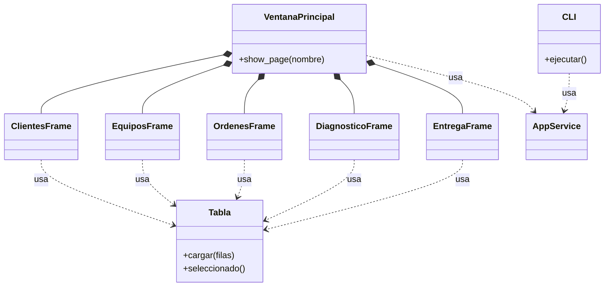

# 🏗️ Arquitectura — ACDC Service Manager

El sistema usa una **arquitectura por capas**. Cada capa solo conoce a la que tiene debajo, así que la interfaz nunca toca los archivos JSON ni las reglas del negocio directamente.

## 1. Capas del sistema

| Capa | Carpeta | Qué hace |
|---|---|---|
| **Interfaz** | `src/ui/` | Ventana Tkinter, formularios, tabla reutilizable y consola (CLI). |
| **Servicios** | `src/services/` | `AppService` (casos de uso) y `DataManager` (lectura/escritura de JSON). |
| **Dominio** | `src/domain/` | Entidades `Cliente`, `Equipo`, `OrdenServicio`, estados y excepciones. |
| **Datos** | `data/` | Archivos `clientes.json`, `equipos.json` y `ordenes.json`. |

## 2. Flujo de estados de una orden

## 3. Diagramas de clases

Para que se lean bien, el diagrama está dividido en tres: **dominio**, **servicios** e **interfaz**.

### 3.1 Dominio

`OrdenServicio` guarda el id del cliente y del equipo (no los objetos), por eso las relaciones van punteadas.

**Excepciones** (todas heredan de `ACDCError`, así la interfaz captura un solo tipo de error):

### 3.2 Servicios y persistencia

### 3.3 Interfaz

> Los cinco frames y la `CLI` reciben el mismo `AppService`; por claridad solo se dibuja la flecha de `VentanaPrincipal` y `CLI`.

## 4. Decisiones de diseño

- **Encapsulamiento:** las entidades guardan sus datos en atributos privados y los exponen con `@property`. Todas las validaciones están en el constructor.
- **Una sola puerta de entrada:** la interfaz solo habla con `AppService`.
- **Persistencia aislada:** únicamente `DataManager` lee y escribe JSON. Cambiar el formato no afecta al resto.
- **Excepciones propias:** `ACDCError` y sus hijas permiten mostrar mensajes claros sin que la ventana se cierre.
- **Dos interfaces, un mismo servicio:** `python -m src.main` abre la GUI y `python -m src.main --cli` abre la consola.
