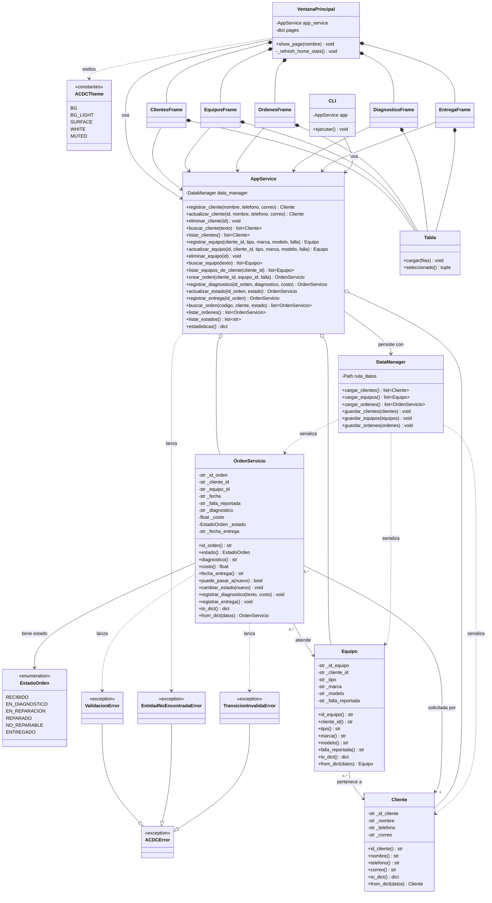

## Diagrama de clases

**Lectura rápida del diagrama:**
- **Dominio:** `Cliente`, `Equipo` y `OrdenServicio` encapsulan sus datos. `EstadoOrden` controla el flujo de estados.
- **Servicios:** `AppService` es la única puerta de entrada para la interfaz, y `DataManager` es el único que toca los JSON.
- **Interfaz:** `VentanaPrincipal` contiene los cinco formularios, que comparten la clase `Tabla`. `CLI` es la alternativa en consola.
- **Excepciones:** las tres heredan de `ACDCError`.
